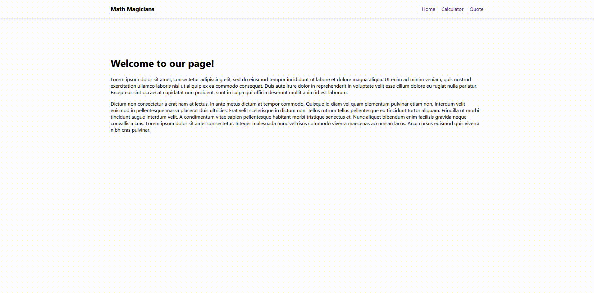

# Math Magicians

> A simple react calculator for @microverse.

## Live Demo
- (Heroku)[https://math-magicians-fernandorpm.herokuapp.com/]
- (Netlify)[https://elegant-leavitt-5ca716.netlify.app/]

## Built With

- HTML/CSS
- React

## Getting Started

### Install

- `git clone https://github.com/fernandorpm/math-magicians.git`
- `npm install`
- `yarn start`

### Testing
- `npm run test`

## Authors

👤 **Fernando R P Marques**

- GitHub: [@fernandorpm](https://github.com/fernandorpm)
- Twitter: [@rpm_fernando](https://twitter.com/rpm_fernando)
- LinkedIn: [Fernando R P Marques](https://linkedin.com/in/fernandorpm)

## 🤝 Contributing

Contributions, issues, and feature requests are welcome!

Feel free to check the [issues page](../../issues/).

## Show your support

Give a ⭐️ if you like this project!

## License

This project is [MIT](./MIT.md) licensed.

